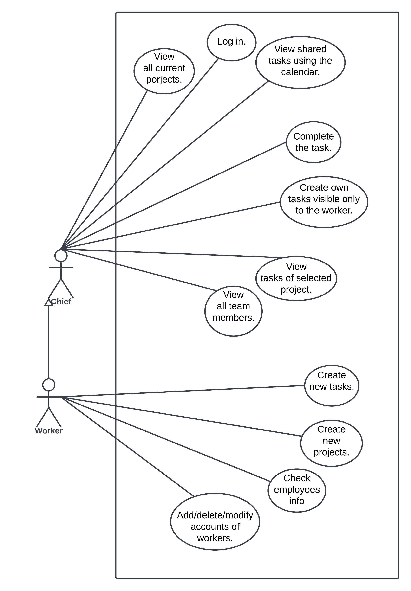
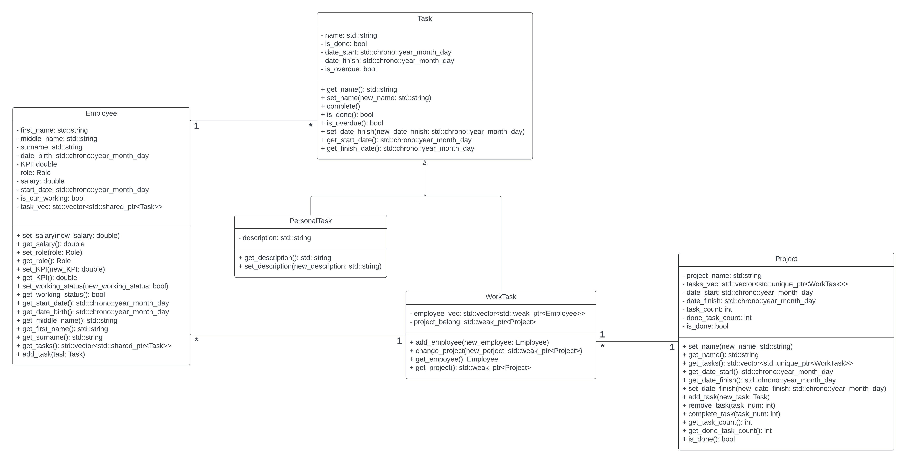

Project managment tool
======

Course project on the subject of OOP

## Diagrams ##

## Application functionality ##
 * User authorization
 * Creating projects
 * Adding tasks to projects
 * Adding tasks to employees
 * View all projects
 * Viewing project information
 * Viewing the list of projects
 * View all tasks using the calendar
 * Creating personal tasks
 * Adding new employees
 * Viewing the list of employees
 * Viewing employee information
